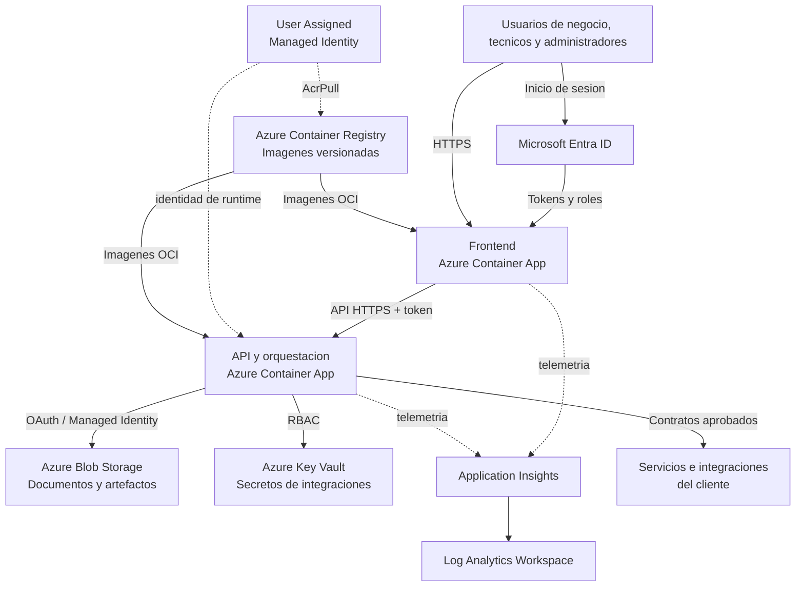
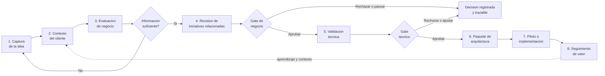

# AI VALUE HUB - Partner Deployment Kit

Repositorio de referencia para partners que implementan AI VALUE HUB en Azure.
Incluye arquitectura, seguridad, infraestructura como codigo y automatizacion para
llevar una instancia desde sandbox hasta produccion.

**Architecture design:** Marco Antonio Salas Robles, Sr. Cloud Solution Architect.

> [!IMPORTANT]
> This is a personal, community-maintained project. It is not an official Microsoft product or Azure service, and Microsoft does not provide support or warranties for it. The repository contains a working demo, infrastructure templates, and operational guidance; items marked as roadmap are not implemented. Review security, compliance, availability, and cost requirements before using it in production.

## Que es AI VALUE HUB

AI VALUE HUB es una plataforma para convertir ideas de inteligencia artificial en
iniciativas comparables, gobernadas y listas para ejecucion. Centraliza el recorrido
desde la captura de una necesidad de negocio hasta su evaluacion, validacion tecnica,
definicion arquitectural y seguimiento como caso de uso.

La herramienta permite que usuarios de negocio, evaluadores y equipos tecnicos
trabajen sobre un mismo registro de la iniciativa. El contexto de la empresa ayuda
a evaluar cada idea frente a prioridades, restricciones y criterios propios del
cliente. Los resultados estructurados mantienen trazabilidad sobre las decisiones.

Capacidades principales:

- captura estructurada de ideas, problema, valor esperado y usuarios afectados;
- evaluacion de alineacion de negocio, viabilidad, riesgos y datos faltantes;
- deteccion de iniciativas relacionadas para reducir duplicidad de esfuerzos;
- validacion tecnica guiada y registro de decisiones por etapa;
- generacion de un paquete inicial de arquitectura, integraciones y siguientes pasos;
- aislamiento de configuracion y datos por cliente y ambiente;
- observabilidad y controles para operar la solucion en Azure.

Este repositorio no contiene el codigo fuente del producto. Distribuye el contrato
de despliegue, la infraestructura y las guias que necesita un partner para instalar
las imagenes oficiales, configurar Entra ID y completar las integraciones.

## Arquitectura de componentes

Cada instancia dedicada se despliega en un Resource Group del cliente. El frontend
y la API se ejecutan en Azure Container Apps. Una Managed Identity permite que la
API acceda a Storage y Key Vault sin credenciales embebidas. Entra ID autentica
usuarios y Application Insights centraliza la telemetria del runtime.

| Componente | Responsabilidad |
| --- | --- |
| Frontend | Experiencia web, autenticacion y vistas segun rol |
| API | Reglas de negocio, orquestacion, autorizacion e integraciones |
| Entra ID | Identidad, tokens, roles de aplicacion y acceso del cliente |
| Blob Storage | Documentos de contexto y artefactos generados |
| Key Vault | Secretos que no pueden resolverse mediante Managed Identity |
| Managed Identity | Acceso del runtime a recursos Azure con minimo privilegio |
| App Insights y Log Analytics | Trazas, metricas, diagnostico y retencion |
| Container Registry | Distribucion de imagenes inmutables de cada release |

La vista detallada, los limites de responsabilidad y la evolucion a multi-tenancy
se describen en
[la arquitectura de referencia](docs/architecture-overview.md).

## Arquitectura de flujo

El flujo funcional conserva una unica iniciativa a traves de gates explicitos.
Una idea puede solicitar aclaraciones, avanzar, quedar pausada o ser rechazada con
su justificacion. Una aprobacion de negocio no sustituye la validacion tecnica.

1. El usuario registra el problema, valor esperado, alcance e interesados.
2. La plataforma aplica el contexto, las restricciones y prioridades del cliente.
3. La evaluacion de negocio identifica valor, riesgo, supuestos y aclaraciones.
4. Se revisan posibles iniciativas similares antes de comprometer nueva inversion.
5. El equipo tecnico valida datos, seguridad, integraciones y factibilidad.
6. Una idea aprobada obtiene componentes, riesgos y una ruta inicial de despliegue.
7. El cliente gobierna piloto y produccion mediante sus procesos de entrega.
8. Los resultados alimentan metricas y futuras decisiones de portafolio.

## Modelos soportados

| Modelo | Uso recomendado | Operacion |
| --- | --- | --- |
<!-- markdownlint-disable MD013 -->
| SaaS administrado | Clientes que priorizan rapidez y actualizaciones continuas | Plataforma multi-tenant operada por el proveedor |
| Instancia dedicada | Clientes regulados o con requisitos estrictos de aislamiento | Recursos desplegados en la suscripcion del cliente |
<!-- markdownlint-enable MD013 -->

La primera version del kit implementa una **instancia dedicada por cliente** y
mantiene configuracion, identidad y datos separados por ambiente. Esta base permite
evolucionar posteriormente a un SaaS multi-tenant sin crear variantes del producto.

## Inicio rapido

1. Revise [la arquitectura](docs/architecture-overview.md) y
   [los prerrequisitos](docs/deployment-guide.md).
2. Ejecute `./scripts/preflight.ps1` para comprobar Azure CLI, permisos y parametros.
3. Despliegue un sandbox con `./scripts/deploy.ps1 -Environment dev`.
4. Configure Entra ID siguiendo [la guia de identidad](docs/entra-onboarding.md).
5. Ejecute `./scripts/validate-deployment.ps1` y complete
   [la lista de produccion](docs/production-readiness-checklist.md).

## Deploy to Azure

<!-- markdownlint-disable MD013 -->

<!-- markdownlint-enable MD013 -->

El boton es apropiado para sandbox y usa el artefacto compilado de `main`. Para
produccion use una release estable y el script o un pipeline con `what-if`, aprobacion
y validacion posterior.

## Principios del kit

- Managed Identity y Key Vault; ningun secreto se almacena en Git.
- App Registration y roles de aplicacion separados por ambiente.
- Configuracion del cliente fuera del codigo de la aplicacion.
- Observabilidad, respaldo, recuperacion y rollback incluidos en la preparacion.
- Releases versionadas y compatibles entre aplicacion e infraestructura.

Consulte
[el modelo de soporte y gobierno](docs/partner-operating-model.md)
antes de iniciar una implementacion con un cliente.
