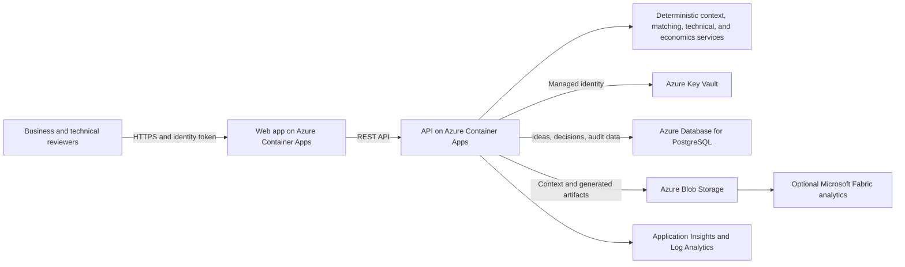

# Govern and prioritize enterprise AI initiatives on Azure

This solution idea describes a workflow for collecting enterprise AI initiatives, assessing their business value and technical feasibility, avoiding duplicate investment, and producing an architecture handoff. AI Value Hub is the associated reference implementation.

> [!NOTE]
> This file is a pre-submission draft. Azure Architecture Center maintainers determine the final scope, structure, metadata, artwork, and publication. Replace the Mermaid draft with an approved Azure architecture diagram before submission.

## Architecture

The following diagram represents the recommended production architecture, not the current MVP deployment.

The internet-facing application boundary terminates HTTPS and authenticates users through Microsoft Entra ID in the target architecture. The workload identity boundary separates application code from Azure resources. Data services form a restricted persistence boundary. A separate analytics boundary receives only approved, minimized portfolio data.

## Workflow

1. A business user signs in and submits an initiative, expected outcome, and supporting context.
2. The API validates the request and stores the idea in the tenant's data scope.
3. Normalized title and Jaccard token-overlap checks identify potentially overlapping active initiatives for human review.
4. Deterministic context rules produce a business assessment and guided clarification when evidence is incomplete.
5. An initiative that passes the business gate receives an automatic deterministic technical assessment. Blocking results reject the initiative; ambiguous results create guided technical questions.
6. A technical reviewer examines the automatic result, clarification history, feasibility, risk, and dependencies, then records the final human approval or rejection.
7. An approved initiative produces a JSON architecture package and downloadable PDF for expert review and delivery planning.
8. The economics service normalizes expected value and estimates recurring platform cost. Moving the initiative to funding is blocked for unfavorable, marginal, or unquantified results unless the technical reviewer explicitly overrides the gate.
9. Admin metrics and optional Fabric bronze, silver, and gold exports support portfolio reporting. Production-grade immutable audit logging remains a recommended enhancement.

## Potential use cases

Use this pattern for enterprise AI intake portals, center-of-excellence portfolio governance, partner-led discovery programs, innovation-fund qualification, and pre-architecture triage across business units.

This pattern is not appropriate as an autonomous investment authority, a replacement for architecture or security review, a regulated credit or employment decision system, a model-serving platform, or a substitute for detailed workload cost modeling.

## Recommendations

- Keep business and technical approvals independent and attributable.
- Treat duplicate detection and scoring as decision support, not final decisions.
- Label deterministic automated assessments as system recommendations rather than model or agent judgments.
- Store score inputs, rule versions, reviewer actions, and override reasons.
- Require evidence and confidence ranges for expected value estimates.
- Separate tenant data and deployment environments.
- Queue long-running evaluations instead of holding synchronous API requests.
- Use synthetic demo data and define production data retention before onboarding users.

## Components

| Component | Purpose | Current reference state |
|---|---|---|
| Azure Container Apps | Hosts independently deployable web and API containers | The API manifest and deployment scripts are present; full-stack Bicep declarations remain incomplete |
| Microsoft Entra ID | Authenticates users and supplies role claims | Target only; selecting the provider currently returns HTTP 501 and demo bearer sessions are the active method |
| Managed identities | Authenticates workloads to Azure resources | Identity resource exists; complete least-privilege assignments remain required |
| Azure Key Vault | Stores secrets and configuration references | Foundation resource is included |
| Azure Blob Storage | Stores uploaded context files | Cloud provider with local fallback is implemented; generated package data remains in SQLite and PDFs are generated on demand |
| Azure Database for PostgreSQL | Provides managed relational persistence | Optional foundation resource; application migration from SQLite remains required |
| Azure Container Registry | Stores versioned application images | Optional foundation resource and push automation are included |
| Application Insights and Log Analytics | Centralize telemetry and diagnostics | Foundation resources are included; production alerts and runbooks remain required |
| Microsoft Fabric | Supports optional portfolio analytics | Optional integration scripts and medallion guidance are included |

The reference UI and generated workflow content support Spanish, English, and Portuguese. Spanish is the canonical processing language. The current automated assessments are local deterministic Python rules; Microsoft Foundry is not a runtime dependency.

## Alternatives

- Use Azure App Service when a conventional web-hosting model and integrated deployment slots are preferred over container revision management.
- Use Azure Kubernetes Service when the organization already operates Kubernetes and needs cluster-level controls; accept greater operational overhead.
- Use Azure SQL Database when organizational skills, integrations, or governance standards favor SQL Server compatibility.
- Use Azure Functions or Container Apps jobs for asynchronous evaluation tasks with bursty demand.
- Start with deterministic rules when explainability is more important than semantic flexibility. Add model-assisted evaluation only when measured quality justifies cost and governance overhead.
- Use existing portfolio-management tooling when AI-specific context, economics, and architecture handoff do not justify a dedicated application.

## Considerations

### Reliability

Keep API instances stateless, use managed database backups, configure health probes, and test restore procedures. Use availability zones where supported and justified. Define recovery time and recovery point objectives before selecting database redundancy. Container Apps revisions provide application rollback, but schema and data rollback require separate procedures.

### Security

Use Microsoft Entra ID, least-privilege application roles, managed identities, Key Vault references, and separate subscriptions or resource groups by environment. Disable public data access where feasible, use private endpoints for production data services, validate uploads, scan dependencies and images, and preserve immutable audit events. Threat-model cross-tenant access, prompt injection through context documents, insecure generated artifacts, and reviewer privilege escalation.

### Cost Optimization

Container Apps consumption can reduce idle compute cost, but minimum replicas, logging volume, Fabric capacity, database sizing, storage retention, and external model calls can dominate spend. Apply budgets and alerts, tune telemetry sampling and retention, and use representative volumes in the Azure pricing calculator. Keep the initiative economics estimate separate from the platform's own operating budget.

### Operational Excellence

Use Bicep and immutable image tags, validate infrastructure before deployment, promote changes through environments, and retain a tested rollback path. Define owners for scoring rules, security, data, and platform operations. Monitor failed evaluations, queue age, approval latency, error rate, saturation, and cost anomalies. Use runbooks for identity, storage, database, and deployment failures.

### Performance Efficiency

Scale web and API containers independently. Add asynchronous queues for document analysis or model calls, index common portfolio queries, cap upload size, and paginate lists. Establish latency and concurrency targets, then load-test with realistic idea volume and document size. Cache only data whose tenant scope and invalidation behavior are explicit.

## Responsible AI

Scores can reflect missing evidence, subjective rules, future model or prompt changes, and biased historical decisions. Show factors and confidence to reviewers, preserve human authority, record overrides, monitor false duplicate matches, and test outcomes across relevant business groups. Provide a correction and appeal path.

Minimize personal and confidential data, document lawful purpose, enforce retention and deletion, and restrict analytics exports. Evaluate model-assisted components for quality, groundedness, harmful content, and prompt-injection resistance. Generated architecture packages are drafts and require qualified human review.

## Deploy this scenario

Use the [Azure deployment plan](AZURE_DEPLOYMENT_PLAN.md) and the [infrastructure guide](../infra/README.md) for the reference deployment kit. Begin in a nonproduction subscription. Replace demo authentication and SQLite, complete RBAC assignments, configure network isolation, remove demo credentials, establish alerts and backups, and run security and recovery tests before production use.

## Contributors

*Microsoft maintains the published article. The following contributor designed the original architecture and reference implementation.*

Principal architect:

- Marco Antonio Salas Robles | Sr. Cloud Solution Architect | [GitHub](https://github.com/makanto32)

Architecture, security, Responsible AI, and independent implementation reviewers are to be confirmed.

## Next steps

- Validate the deployment with an independent customer or partner implementation.
- Produce an approved Azure icon diagram with data flows and trust boundaries.
- Capture measured scale, availability, recovery, and cost evidence.
- Complete security, Well-Architected, Responsible AI, privacy, and editorial reviews.
- Submit the [Architecture Center proposal](architecture-center-proposal.md) before preparing a publication pull request.
