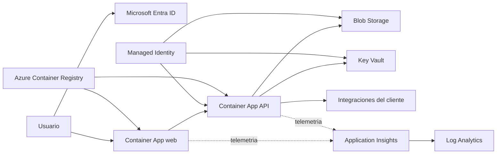

# Arquitectura de referencia

## Alcance

Este kit despliega una instancia dedicada de AI VALUE HUB en la suscripcion del
cliente. La aplicacion se entrega como imagenes versionadas; el partner configura
identidad, red, integraciones y operacion sin modificar el producto.

## Limites de responsabilidad

- **Producto:** imagenes OCI, contratos API, migraciones y notas de version.
- **Kit:** recursos Azure, parametros, validaciones y guias de configuracion.
- **Partner:** aterrizaje en Azure, Entra ID, DNS, red e integraciones.
- **Cliente:** aprobaciones, clasificacion de datos, accesos y operacion.

## Recursos desplegados

- Resource Group por cliente y ambiente.
- Azure Container Apps para frontend y API.
- User Assigned Managed Identity.
- Storage Account sin acceso publico a blobs ni Shared Key.
- Key Vault con RBAC y proteccion reforzada en produccion.
- Application Insights, Log Analytics y retencion por ambiente.
- Roles minimos para Storage, Key Vault y ACR privado opcional.

## Evolucion a SaaS

Una oferta SaaS multi-tenant debe agregar un plano de control, aprovisionamiento de
tenants, aislamiento verificable de datos, medicion, limites por tenant y procesos de
borrado/exportacion. No reutilice una instancia dedicada como multi-tenant solo
agregando un `tenantId`; requiere una revision de amenazas y de contratos de datos.
